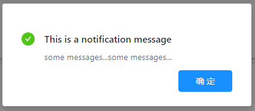

### Confirm(确认弹出框)

参数 | 说明 | 类型 | 默认值 |支持版本号
---|---|---|---|---|
type |弹出框类型，包含info,success,warn,error四种类型 | String | 'info' | >=1.8.62
title | 标题 | String|ReactNode || >=1.8.62
content | 内容 | String|ReactNode || >=1.8.62

#### 组件以Modal.info/Modal.success/Modal.confirm为基础封装，将风格与样式规范化，其他属性参考antd官网查询

### 弹窗效果图

1.提示

2.成功

3.错误&警示

4.警告

