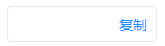

### Copy(复制)

*说明：可复制输入框、文本、url等；



如果要运用到Input组件(如上图)，则需要自定义Copy的位置样式，例如添加style或者className


使用示例：

```
<div className="copy-wrapper">
    <Input style={{ width: '150px', paddingRight: '42px' }} id="inpt" />
    <Copy selector="#inpt" />
</div>
```

参数 | 说明 | 类型 | 默认值 |支持版本号
---|---|---|---|---|
selector |复制目标元素的DOM选择器，例如'#demo' | String |  | >=1.8.62
text | 显示文本 | String || >=1.8.62
isButton | 是否渲染成Button，默认渲染成a标签 | Boolean |false| >=1.8.62
|className| 样式名 | String || >=1.8.62
|style| 样式对象 | Object || >=1.8.62

